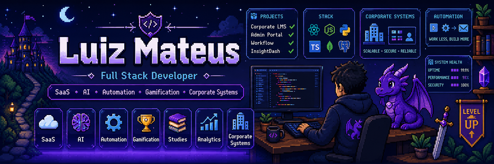

<h1 align="center">Luiz Mateus Fortes dos Santos</h1>

<h3 align="center">
  Full Stack Developer | Corporate Systems | SaaS | Automation
</h3>

<p align="center">
  Desenvolvedor Full Stack focado em sistemas corporativos, plataformas SaaS, APIs, dashboards, automações e produtos digitais com IA.
</p>

<p align="center">
  <a href="https://chronosguardian.com.br">
    
  </a>
  <a href="mailto:xtremegamest@gmail.com">
    
  </a>
</p>

---

## Sobre mim

Sou desenvolvedor Full Stack e estudante de Engenharia da Computação, com foco em sistemas corporativos, aplicações web, SaaS, automações e soluções orientadas a dados.

Tenho experiência na construção de sistemas do zero, modelagem de banco de dados, desenvolvimento de APIs, criação de dashboards administrativos, fluxos de aprovação, integrações e interfaces web modernas.

Atualmente trabalho e estudo principalmente com:

* Sistemas corporativos e plataformas internas
* Desenvolvimento Full Stack com TypeScript, React, Next.js e Node.js
* APIs, integrações e automações
* Dashboards, indicadores e visão gerencial
* SaaS com IA, gamificação e produtividade
* Documentação técnica e arquitetura de software

---

## Foco técnico

```txt
Corporate Systems  → Portais internos, fluxos, permissões, auditoria e dashboards
Full Stack         → Frontend, backend, banco de dados, APIs e deploy
SaaS               → Produtos digitais, usuários, planos, limites e recorrência
Automation         → Rotinas, integrações, scripts, OCR, Playwright e produtividade
Analytics          → Indicadores, relatórios, exportações e visão gerencial
```

---

## Stack principal

<p>
  
  
  
  
  
  
  
  
  
  
  
  
</p>

---

## Projetos privados e cases de atuação

> Os projetos abaixo são privados. Código-fonte, dados, regras internas e informações sensíveis não são públicos. As descrições apresentam apenas uma visão técnica geral da minha atuação.

### Chronos Guardian

SaaS de estudos com IA, gamificação, timer, flashcards, missões, streaks e evolução de progresso.

Principais pontos técnicos:

* Geração de cronogramas por IA
* Flashcards inteligentes
* Sistema de planos e limites de uso
* Gamificação com pet guardião
* Interface web moderna
* Deploy com Vercel e Supabase

---

### Prime Gym

Aplicação privada voltada para gestão, organização e acompanhamento de rotinas relacionadas ao ambiente fitness.

Principais pontos técnicos:

* Estruturação de aplicação web
* Organização de dados e fluxos
* Interface administrativa
* Modelagem de entidades
* Evolução incremental de funcionalidades

---

### Sistema Corporativo de Capacitação

Atuação em sistema corporativo privado voltado para gestão de cursos, turmas, solicitações, aprovações, dashboards e indicadores gerenciais.

Principais pontos técnicos:

* Desenvolvimento Full Stack
* Fluxos de solicitação e aprovação
* Dashboards gerenciais
* Exportações CSV
* Integrações com bancos relacionais
* Modelagem de dados
* Regras de acesso e auditoria
* Migração e adaptação de arquitetura

---

## Repositórios públicos

Alguns projetos públicos, estudos técnicos e experimentações:

* `Web-Builder` — Web Builder visual para geração de estruturas e interfaces.
* `Poe2_Planner_build` — Ferramenta/estudo para planejamento de builds.
* `Multizap` — Projeto em Python.
* `automation-lab` — Laboratório de automações e estudos técnicos, em construção.

---

## GitHub Stats

<p align="center">
  
  
</p>

---

## Atualmente estudando e construindo

* Evolução de produtos SaaS
* Sistemas corporativos e dashboards gerenciais
* Automações com IA e ferramentas de produtividade
* Arquitetura Full Stack
* Produtos digitais com foco em entrega real

---

## Contato

<p>
  <a href="mailto:xtremegamest@gmail.com">
    
  </a>
  <a href="https://chronosguardian.com.br">
    
  </a>
</p>
